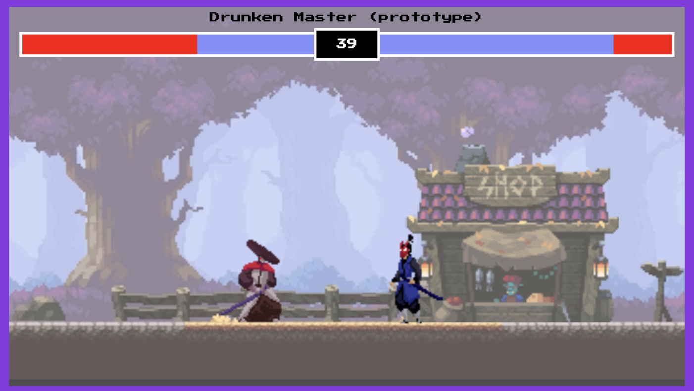

# Drunken Master (Basic 2 Fighter Game)

## Table of contents

-   [Overview](#overview)
    -   [The challenge](#the-challenge)
    -   [Screenshot](#screenshot)
    -   [Links](#links)
    -   [Player Controls](#player-controls)
-   [The process](#the-process)
    -   [Built with](#built-with)
    -   [What was learned](#what-we-learned)
    -   [Continued development](#continued-development)
    -   [Useful resources](#useful-resources)
-   [Authors](#authors)

## Overview

### The challenge

The challenge of this prototype game was to implement a purely JS game that makes use of Objects / Classes catering for 2 players. Utilising HTML's Canvas api made this possible. Also, character spritesheets were used to provide the animation/movement effects.

### Screenshot

-   Screenshot of Drunken Master
    

### Player Controls

-   Player 1: A (left) || D (right) || W (jump) || SPACE (attack)
-   Player 2: Left Arrow || Right Arrow || Up Arrow || Down Arrow (attack)

### Links

-   Playable link: [https://mistergjones.github.io/fighting-game/]
-   Solution Code Frontend: [https://github.com/mistergjones/fighting-game]

## The process

### Built with

-   HTML & CSS for framework and structure
-   JS for game mechanics and player movement

### What was learnt

-   Primary learnings were centered upon establishing objects with associated properties and methods.
-   Instantiating the objects and invoking the methods to derive the player movements.
-   Utilising <canvas></canvas> api to draw the required objects & images.
-   Making the characters change direction and attack each other.
-   Found a font that looks like it was used in classic 80's retro games.

1. The partial function below demonstrates the use of JS's requestAnimation() function, methods for the Canvas's 2d context and invoking sprites to update the screen.

```js
function animate() {
    // call which functino to loop over again to udpate he screen
    window.requestAnimationFrame(animate);
    c.fillStyle = "black"; // set canvas colour to black
    c.fillRect(0, 0, canvas.width, canvas.height);

    // load the background image
    background.update();
    shop.update();

    c.fillStyle = "rgba(255,255,255, 0.3";
    c.fillRect(0, 0, canvas.width, canvas.height);
```

### Continued development

-   Whilst player 2 attack features function correctly, the facing direction is not 100% accurate. This defect needs to be rectified.

## Authors

-   Glen Jones - [https://www.glenjones.com.au]
